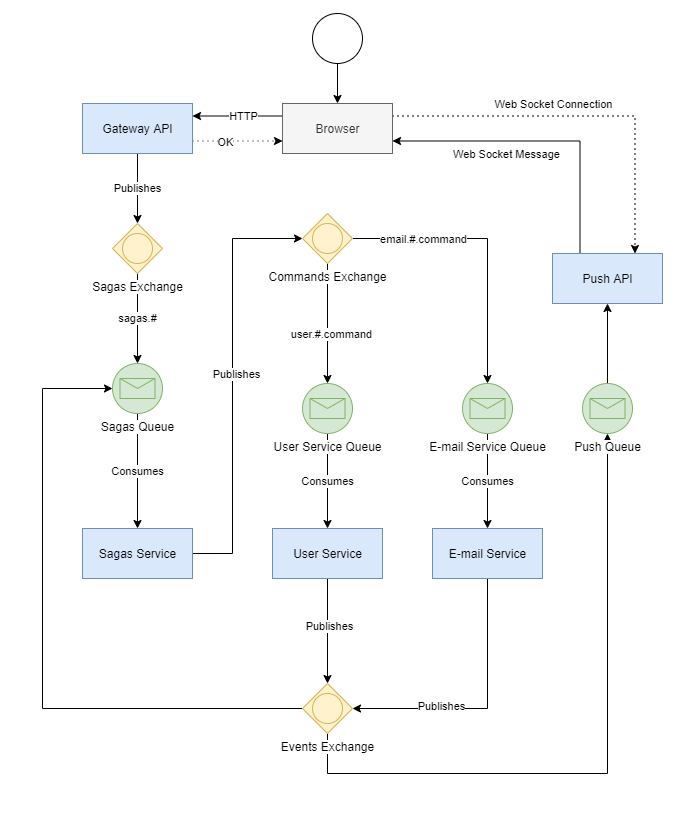

# NanoMQ

A microservices monorepo developed to study a message driven architecture.

- **Messaging Protocol**: AMQP
- **Message Broker**: RabbitMQ
- **Saga Mode**: Managed
- **Patterns**: SOLID
- **Stack**:
  - Javascript & Typescript
  - Express for Gateway APIs
  - RXJS to handle messages
  - Menash to Javascript MQ integration

## Topology

- Gateway API: Exposes HTTP endpoints, validate input schema and publishes sagas messages to sagas.exchange
- Sagas Services: Subscribes to sagas and event messages and publishes command messages to commands.exchange
- Services: Subscribes to command messages (input), do business and publishes event (output) messages to event.exchange
  - User Service
  - E-mail Service
- Push Service: (WIP) a SSE server to push messages to client (browser, webhook), it subscribes to event messages and it filters which messages should be pushed. It is designed for handle async requests completion signals (saga finished) and display notifications.

